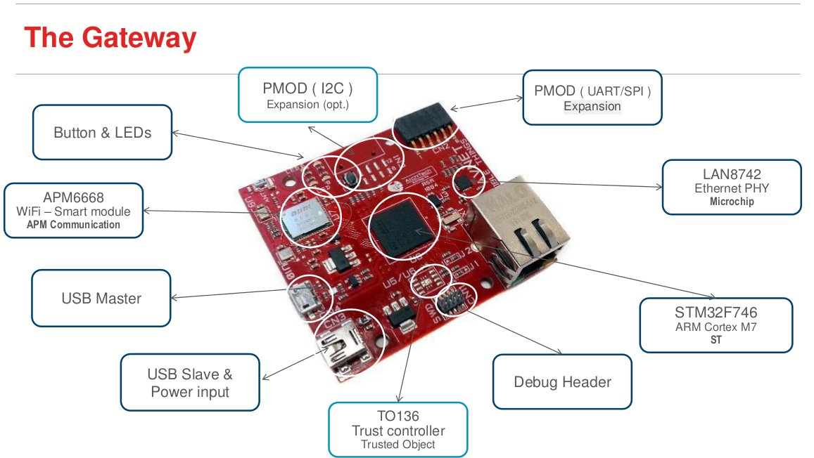

.. The Gateway documentation master file

Welcome to The Gateway documentation!
=====================================

:Version: 1.00A
:Copyright: (C)2016 Avnet Memec Silica company
:Date: 12 Apr 2016
:Reference name: BAEVTGW001

The Gateway Solution
--------------------

.. image:: _static/board.jpg

*The Gateway*

.. index:: index

**INTRODUCTION**
----------------

The gatway board manages all the necessary connectivity to the cloud service via WiFi. It comes with an antenna and a mini USB cable. It manages a smart sensor board including Bluetooth Smart connectivity and a range of sensors including motion, temperature/humidity and light/proximity. The kit also contains an integrated antenna and a mini-USB cable. A GSM peripheral module with embedded SIM and SIM-connector options is available as an expansion option to the gateway board to enable cellular connectivity up to cloud enterprise software services.

Hardware Specification
----------------------

================================== ==================================
Image part                         Description
================================== ==================================
.. image:: _static/PMOD-I2C.jpg     | PMOD ( I2C ) - Expansion (opt.)
                                    | - I2C communication
.. image:: _static/ButtonLeds.jpg   | Button & LEDs
                                    | - programmable by firmware
.. image:: _static/APM6668.jpg      | APM6668 - WiFi – Smart module - APM Communication
                                    | - it is a transceiver module made by apm Communication, Inc
                                    | one of a range of cost-effective, simple to integrate, and high performance transceivers
.. image:: _static/USB-master.jpg   | USB Master
.. image:: _static/USB-slave.jpg    | USB Slave & Power input
.. image:: _static/TO136.jpg        | TO136 Trust controller Trusted Object
                                    | - Secure Element and Solution for IoT and M2M applications
.. image:: _static/DebugHeader.jpg  | Debug Header
.. image:: _static/STM32F746.jpg    | STM32F746 ARM Cortex M7 ST
                                    | - device based on the high-performance ARM®Cortex®-M7 32-bit RISC core 
                                    | operating at up to 216 MHz frequency.
.. image:: _static/LAN8742.jpg      | LAN8742 Ethernet PHY
                                    | - the LAN8742/LAN8742i is a low-power 10BASE-T/100 BASE-TX physical layer (PHY) 
                                    | transceiver  compliant with  the  IEEE  802.3 and 802.3u standards. 
.. image:: _static/PMOD-UART.jpg    | PMOD ( UART/SPI ) Expansion
================================== ==================================

Document references
*******************

The board reference documentation is available on:

- the `Silica Visible Things <http://silica.com/webapp/wcs/stores/servlet/en/silica/visible-things-kits>`_ website. 
- the `architech-board <http://architechboards.org>`_ website. 

