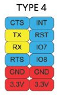

.. The Gateway documentation master file

Welcome to The Gateway documentation!
=====================================

:Version: 1.00A
:Copyright: (C)2016 Avnet Memec Silica company
:Date: 12 Apr 2016
:Reference name: BAEVTGW001

The Gateway Solution
--------------------

*The Gateway*

.. index:: index

**INTRODUCTION**
----------------

.. image:: _static/gateway.jpg

Hardware Specification
----------------------

================================= =================================
image                             note
================================= =================================
.. image:: _static/pmod_type4.jpg  | PMOD ( I2C ) - Expansion (opt.)
                                   | altro
.. image:: _static/pmod_type4.jpg  | Button & LEDs
.. image:: _static/pmod_type4.jpg  | APM6668 - WiFi – Smart module - APM Communication
.. image:: _static/pmod_type4.jpg  | USB Master
.. image:: _static/pmod_type4.jpg  | USB Slave & Power input
.. image:: _static/pmod_type4.jpg  | TO136 Trust controller Trusted Object
.. image:: _static/pmod_type4.jpg  | Debug Header
.. image:: _static/pmod_type4.jpg  | STM32F746 ARM Cortex M7 ST
.. image:: _static/pmod_type4.jpg  | LAN8742 Ethernet PHY
.. image:: _static/pmod_type4.jpg  | PMOD ( UART/SPI ) Expansion
================================= =================================

Document references
*******************

The board reference documentation is available on:

- the `architech-board <http://architechboards.org>`_ website. 

- the `mu709S2 documentation <http://consumer.huawei.com/en/solutions/m2m-solutions/products/support/user-guides/mu709s-6-en.htm>`_

- the `me909s documentation <http://consumer.huawei.com/en/solutions/m2m-solutions/products/support/user-guides/me909s_821_en.htm>`_

