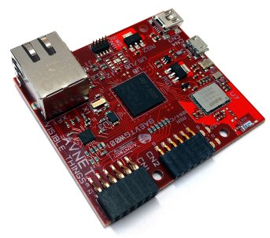

.. The Gateway documentation master file

Welcome to The Gateway documentation!
=====================================

:Version: 1.00B
:Copyright: (C)2016 Avnet Silica company
:Date: 6 Jul 2016
:Reference name: BAEVTGW001

The Gateway Solution
--------------------

*The Gateway*

.. index:: index

**INTRODUCTION**
----------------

The gateway board manages all the necessary connectivity to the cloud service via WiFi. It can manage smart sensor boards via Bluetooth Smart connectivity. The board also contains an integrated antenna.

Some PMODtm connectors enable expansion of the board peripherals and connectivity:  as an example a GSM peripheral module with embedded SIM and SIM-connector options is available as an expansion option to the gateway board to enable cellular connectivity up to cloud enterprise software services

Hardware Specification
----------------------

================================== ==================================
Image part                         Description
================================== ==================================
.. image:: _static/PMOD-I2C.jpg     .. image:: _static/pmod_i2c.jpg
                                    | PMOD ( I2C ) - Expansion (opt.)
.. image:: _static/PMOD-UART.jpg    .. image:: _static/pmod_type4.jpg
                                    | PMOD ( UART/SPI ) Expansion
.. image:: _static/APM6668.jpg      | APM6668 - WiFi – Smart module - APM Communication
                                    | - it is a transceiver module made by apm Communication, Inc
                                    | one of a range of cost-effective, simple to integrate, and high performance transceivers
.. image:: _static/USB-master.jpg   | USB Host - Device, micro
.. image:: _static/USB-slave.jpg    | USB only to power the board, mini
.. image:: _static/DebugHeader.jpg  | Debug Header
.. image:: _static/TO136.jpg        | Trusted Object
                                    | - TO136 Trust controller
                                    | - Secure Element and Solution for IoT and M2M applications
.. image:: _static/Leds.jpg         | LEDs
                                    | - programmable by firmware
                                    | Button programmable
================================== ==================================

Document references
*******************

The board reference documentation is available on:

- the `Silica Visible Things <http://silica.com/webapp/wcs/stores/servlet/en/silica/visible-things-kits>`_ website. 
- the `architech-board <http://architechboards.org>`_ website. 

